---
# INSTRUCCIONES DE USO
**En el archivo input.txt se ingresa el nombre y la clase de tu personajes el programa solo admite 3 clases Guerrero,Mago y Arquero las cuales tienen cualidades unicas tales como el mago tiene mana, el Arquero tiene
velocidad y presicion, y el Guerrero tiene rabia.**
**En el output se te dara toda la informacion de tu personaje asiganada de manera aleatoria con la cual empezaras y tambien se te daran unos items en tu inventario**  

✅Analisis Lexico  
✅Analisis Sintactico  
✅Analisis Semantico

```mermaid
graph TD
  A[Input] --> B[Analizador Léxico]
  B --> C[Analizador Sintactico]
  B --> D[Analizador Semantico]
  D --> E[Output]
  C --> E[Output]
```

## HERRAMIENTAS
 
## EJEMPLO DE SINTAXIS
PERSONAJE

NOMBRE: darkhexmon12

CLASE: Guerrero

## EJEMPLO DE OUTPUT
PERSONAJE

NOMBRE: DARKHEXMON12

CLASE: GUERRERO

ATRIBUTOS: 

Vida: 100 Inteligencia: 28 Rabia: 6 Fuerza: 85

INVENTARIO: 

espada

escudo

pocion de vida
   
### CODIGO COMPLETO  
📄**CODIGO:**[Ver compilador.cs](Lexer/analisisLexico.cs)
